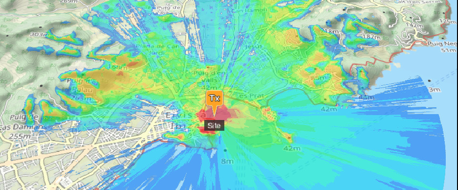

# CloudRF API Clients

The code examples within this repository have been published to help people integrate custom apps with the powerful CloudRF API.

In order to use these examples you require an account on the CloudRF service (or a private server) with a valid API key. This can be obtained from [https://cloudrf.com/my-account](https://cloudrf.com/my-account).

## Examples

Below are the list of available examples which can be used. You are encouraged to read the respective `README.md` for each which will detail additional information and usage.

- The [python](python/) directory contains a parent Python 3 script which allows interaction with all of the primary CloudRF API endpoints. This script is quite comprehensive and so for usage you are recommended to consult the [README](python/README.md) for more information.
- The [bash](bash/) directory contains some Bash scripts which make use of cURL to to CloudRF API.
- The [slippy-maps](slippy-maps/) directory contains examples of various web map libraries which interface with the CloudRF API.
  - You can play with live examples at [https://cloud-rf.github.io/CloudRF-API-clients/slippy-maps/index.html](https://cloud-rf.github.io/CloudRF-API-clients/slippy-maps/index.html)
- The [templates](templates/) directory contains example JSON templates which can be used to streamline planning with the API. 
- The [model-gallery](model-gallery/) directory contains a demonstration of 3D models.
  - You can explore some 3D models at [https://cloud-rf.github.io/CloudRF-API-clients/model-gallery/index.html](https://cloud-rf.github.io/CloudRF-API-clients/model-gallery/index.html)

## Commercial Use

You are free to use the public API in commercial apps with attribution to *CloudRF*. If you need an exemption get in touch or buy [your own server](https://cloudrf.com/soothsayer).

*An example of acceptable use would be a online map with an option to add RF coverage as an extra layer.*

If you are building an application or a business which is **critically dependent** upon our API, you should contact us first to let us know and establish a service level agreement. 

*A random example of unacceptable use would be a used car salesman with a business MBA launching a new RF planning tool, without prior communication, which just wraps our API for a markup.*

Full terms and conditions are available at [https://cloudrf.com/terms-and-conditions](https://cloudrf.com/terms-and-conditions)

You will be responsible for your account and how it is used so be good as we can be savage with miscreants.

## Resources

Below are a list of resources which may aid you with writing your own clients to integrate with the CloudRF API.

- CloudRF Website: [https://cloudrf.com/](https://cloudrf.com/)
- OpenAPI Reference: [https://cloudrf.com/documentation/developer/](https://cloudrf.com/documentation/developer/)
- Postman API docs: [https://docs.cloudrf.com/](https://docs.cloudrf.com/)
- User Interface: [https://cloudrf.com/ui/](https://cloudrf.com/ui/)
- User Documentation: [https://cloudrf.com/documentation](https://cloudrf.com/documentation)
- Video Tutorials: [https://youtube.com/cloudrfdotcom](https://youtube.com/cloudrfdotcom)

## Live demos

Paste your [API key]((https://cloudrf.com/my-account)) into these demos and click away.

[Area coverage](https://cloud-rf.github.io/CloudRF-API-clients/slippy-maps/leaflet-area.html)

[Multisite API](https://cloud-rf.github.io/CloudRF-API-clients/slippy-maps/leaflet-multisite.html)

[Path / Point-to-Point](https://cloud-rf.github.io/CloudRF-API-clients/slippy-maps/leaflet-path.html)

[Many Points to one](https://cloud-rf.github.io/CloudRF-API-clients/slippy-maps/leaflet-points.html)

[Cell-Tower sectors](https://cloud-rf.github.io/CloudRF-API-clients/slippy-maps/leaflet-celltowers.html)

[Trilateration / Geo-location](https://cloud-rf.github.io/CloudRF-API-clients/slippy-maps/leaflet-trilateration.html)

[Interference API](https://cloud-rf.github.io/CloudRF-API-clients/slippy-maps/leaflet-interference.html)

[Spectrum Management](https://cloud-rf.github.io/CloudRF-API-clients/slippy-maps/leaflet-spectrum-management.html)

[Direction Finding](https://cloud-rf.github.io/CloudRF-API-clients/slippy-maps/leaflet-direction-finding.html)

[Multilink API](https://cloud-rf.github.io/CloudRF-API-clients/slippy-maps/leaflet-multilink.html)

[Drone Detection](https://cloud-rf.github.io/CloudRF-API-clients/slippy-maps/leaflet-drone-detection.html)

[Radar Interference](https://cloud-rf.github.io/CloudRF-API-clients/slippy-maps/radar_interference_demo.html)