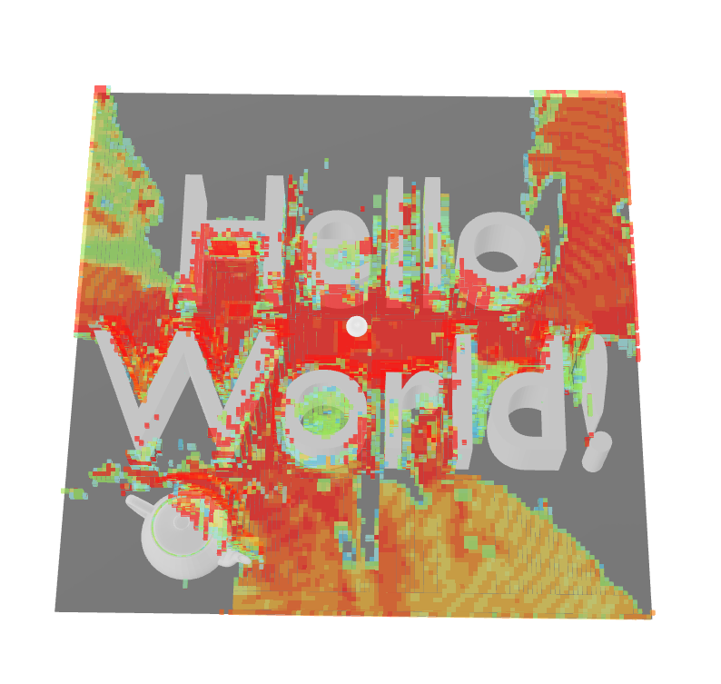
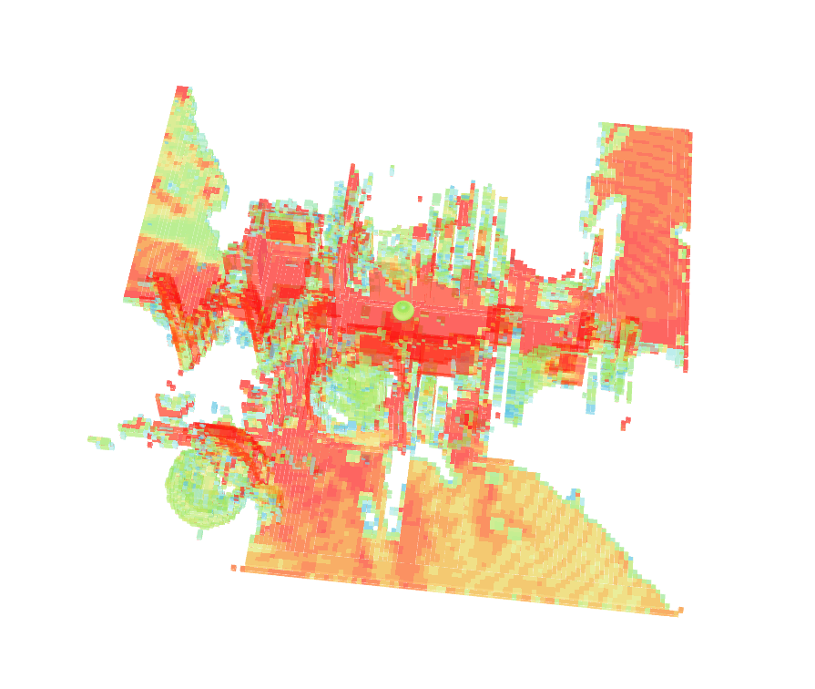

# 3D API Hello World



This README contains all the information needed to get started using the CloudRF 3D API.

## Upload

Download the `hello_world.glb` model file from this folder. This is the model:


Use the following cURL command to upload it to CloudRF, replacing `YOUR_API_KEY_HERE` with your API key.

```bash
curl --location --request POST https://api.cloudrf.com/3d/model/upload --header "key: YOUR_API_KEY_HERE" -F data=@./hello_world.glb
```

The response should look like so:

```json
{
    "message": "Model uploaded OK",
    "file": "hello_world.glb",
    "file_size_MB": 0.125,
    "storage_used_MB": 484.816,
    "storage_remaining_MB": 516
}
```

## Calculation

Now that you have uploaded a 3D model, you can run a calculation with the following cURL command. Again, replace `YOUR_API_KEY_HERE` with your API key.

```bash
curl  --location --request POST https://api.cloudrf.com/3d --header "key: YOUR_API_KEY_HERE" --header "Content-Type: application/json" --data-raw '{
"transmitters": [
        {
            "frq": 416.0,
            "txw": 5.0,
            "pos": {
                "x": 0.0,
                "y": 1.5,
                "z": 0.0
            },
            "antenna": {
                "ant": 1,
                "txg": 2.15,
                "txl": 0.0
            }
        }
    ],
    "3d": {
        "input_file": "hello_world.glb",
        "max_reflections": 3
    },
    "output": {
        "res": 0.2,
        "col": "RAINBOW.dBm",
        "out": 2
    },
    "receiver": {
        "rxs": -100,
        "rxg": 0.0
    }
}'
```

The calculation will take time, but the response will look like the following:
```json
{
    "model_file": "[model_download_link]",
    "model_viewer": "[model_viewer_link]",
    "file_size_MB": 14.396,
    "elapsed_s": 25.05
}
```
For immediate feedback on the result, click the model viewer link. You should see something like the output below. You can also download the model.


