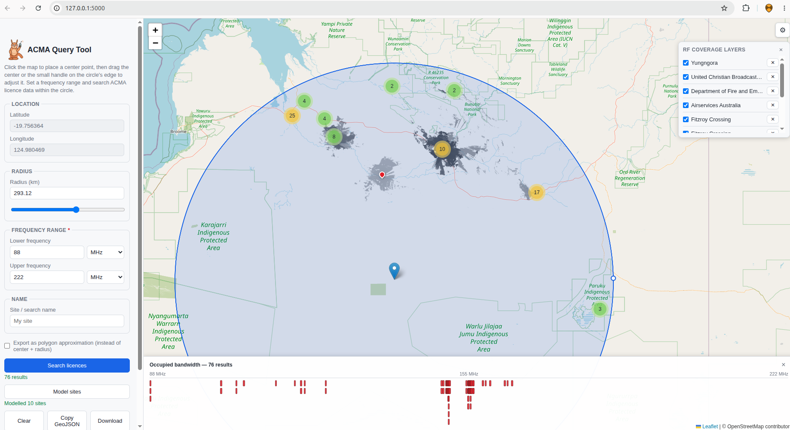

# ACMA Query Tool

A local web app to query the ACMA RRL spectrum data.

Allows searching of a circular area with frequencies. Results are markers with a popup of full site/licence details, and an occupied-bandwidth chart
along the bottom of the map. 

**Model sites** can run CloudRF RF coverage predictions for the nearest sites, overlaid on the map to help an analyst quickly identify interferers.



## Run

```bash
cd map_app
pip install -r requirements.txt
python app.py
```

Then open http://127.0.0.1:5000

To use **Model sites** (CloudRF RF coverage), set a CloudRF API key — either
as an environment variable, or from the app itself via the ⚙ **Settings**
button (top-right of the map). See
[CloudRF integration](#cloudrf-integration-model-sites) below.

## Features

- Click anywhere on the map to place a center point and draw a circle.
- Drag the center marker to move the shape; drag the small handle on the
  circle's edge to resize it (or use the radius number/slider fields).
- **Settings** (⚙, top-right of the map):
  - Switch the base map between **OpenStreetMap**, **Esri World Topo**, and
    **Esri Satellite** — takes effect immediately and is remembered
    (`localStorage`) across reloads. All three are free and need no API key.
    (Bing satellite was considered, but Microsoft's own docs show the
    imagery-metadata API it depends on is retired for free/Basic accounts —
    Esri Satellite is a keyless equivalent, so that's used instead.)
  - Enter a **CloudRF API key** here instead of (or to override) the
    `CLOUDRF_API_KEY` environment variable — saved server-side in
    `data/settings.json` and takes effect immediately, no restart needed.
- Live GeoJSON output as a `Feature`:
  - Default: `Point` geometry + a `radius` (metres) property — GeoJSON has no
    native circle type, so this is the common representation.
  - Optional "polygon approximation" mode: a true `Polygon` ring tracing the
    circle (64 points), for tools that need real polygon coordinates.
- Copy to clipboard, download as a `.geojson` file, or save server-side.
- Saved shapes are stored in `data/shapes.json` and listed in the panel with
  load/delete actions.
- Sidebar is collapsible via the ☰ button in the top-left.
- **Search licences**: set a lower/upper frequency (with a Hz/kHz/MHz/GHz
  unit picker — both fields are mandatory) and click **Search licences** to
  call `/api/search` with the current circle/polygon. Matching sites are
  plotted as red pins, grouped into clusters (via Leaflet.markercluster)
  where many stack up; click a pin (or a cluster, to zoom in) to open a
  popup with the full licence/client/frequency/antenna/station details for
  that device. A status line under the button reports the result count or
  any error. Clicking **Clear** also clears the current results.
- An **occupied-bandwidth chart** runs along the bottom of the map after
  each search: one horizontal bar per result spanning its
  `frequency ± bandwidth/2` range across the searched band, stacked into
  the fewest rows needed so overlapping devices are visible as separate
  rows. Click a bar to zoom/spiderfy to its marker and open its popup
  (and vice versa — opening a marker's popup highlights its bar).
- **Model sites**: after a search, click **Model sites** to run a CloudRF
  Area coverage prediction for the 10 nearest *unique* sites in the results
  (a site with both a transmitter and receiver record counts once, using
  the transmitter's figures). Requests run one at a time; a spinner under
  the button shows which site is currently being modelled. Each finished
  prediction is added as a greyscale PNG overlay on the map, listed in a
  floating **RF coverage layers** panel (top-right of the map, below the
  ⚙ button) with a checkbox to show/hide it and a ✕ to remove it. A site
  that fails (e.g. no frequency on record, or a CloudRF error) is listed
  with its error instead of blocking the rest. Clicking **Clear** also
  removes all coverage layers.

## Search API

`GET|POST /api/search` searches the ACMA RRL data (`../spectra_rrl/spectra_rrl.db`,
built by `spectra_rrl/build_sqlite_db.py`) for licensed devices whose site
falls inside a GeoJSON circle/polygon **and** whose frequency range
(`frequency ± bandwidth/2`) overlaps a given band.

POST body:
```json
{
  "circle": {
    "type": "Feature",
    "properties": { "radius": 20000 },
    "geometry": { "type": "Point", "coordinates": [150.698182, -33.756158] }
  },
  "freq_min": "88 MHz",
  "freq_max": "108 MHz",
  "limit": 500
}
```
- `circle` accepts exactly what the map UI's GeoJSON textbox produces:
  a `Point` + `radius` (metres) Feature, or a `Polygon` approximation.
  A flat `lat`/`lng`/`radius_m` may be given instead of `circle`.
- `freq_min` / `freq_max` accept a plain number (Hz) or a string with a
  unit suffix (`Hz`/`kHz`/`MHz`/`GHz`), e.g. `"2.4GHz"`. At least one of
  the two is required.
- `limit` caps returned features (default 500, max 5000); the response's
  `meta.truncated` says whether more matches exist.

GET accepts the same fields as query-string params (`circle` JSON-encoded):
```
/api/search?lat=-33.756158&lng=150.698182&radius_m=20000&freq_min=88MHz&freq_max=108MHz
```

Response is a GeoJSON `FeatureCollection` — one Feature per matching
device, geometry = its site's location, properties include licence,
client, frequency/bandwidth, distance from the circle's center, antenna
and station details. See `meta` for the echoed query and result count.

## CloudRF integration (Model sites)

`POST /api/cloudrf/area` sends one site's worth of coverage-prediction
request **directly** to `https://api.cloudrf.com/area` (no configurable
base URL / proxy indirection), using the clicked site's own
frequency/power/gain/height/polarisation, then fetches and caches the
resulting PNG so the browser only ever talks to this server (no CloudRF
credentials or CORS dependency in client JS). Antenna modelling is
deliberately generic — ACMA's real antenna *pattern* data (directional
shape, azimuth, tilt) is intentionally not used; only power and gain
figures are. The request is built with:

- `environment.elevation = 2` (Digital Terrain Model), `environment.buildings = 0`,
  `environment.landcover = 0` (as specified)
- `output.res = 180` (metres) and `output.rad` = **half the current search
  radius**, converted to km
- `output.col = 9` ("Greyscale/GIS")
- `antenna.ant = 1` (vertical dipole, omni-directional), `azi`/`tlt` both
  `0` — no directional pattern is modelled (`hbw`/`vbw` are omitted
  entirely, since CloudRF documents those as only applying when `ant = 0`)
- `antenna.txg` = the antenna's real gain from the database (joined via
  `device_details.antenna_id -> antenna.gain`) when on record, else a
  2 dBi default
- `transmitter.txw` = the site's raw transmitter power (paired with the
  real gain above, so nothing is double-counted); falls back to an
  EIRP-derived figure only for the minority of records with no
  transmitter power on file, and to 1 W if neither is present
- Every field is clamped to CloudRF's documented min/max (e.g. frequency
  2–100000 MHz, power ≤ 2,000,000 W, radius ≤ 400 km) before sending —
  real ACMA records occasionally have out-of-range values, and a
  frequency outside CloudRF's range raises a clear per-site error instead
  of being silently sent
- Sensible defaults for everything the task didn't specify (propagation
  model, receiver sensitivity, reliability %, clutter file) — all named
  constants at the top of `cloudrf.py`, easy to retune

Every field name, type, and valid range above (including `output.col`'s
numeric codes and the exact response shape) is verified against CloudRF's
own OpenAPI spec, extracted directly from the embedded ReDoc state on
their [developer docs page](https://cloudrf.com/documentation/developer/)
— not a paraphrase or a fetched-and-summarised guess.

**Setup**: get an API key at [cloudrf.com](https://cloudrf.com), then either:
- enter it in **Settings** (⚙, top-right of the map) — saved to
  `data/settings.json` and used immediately, no restart needed; or
- set it as an environment variable before starting the app:
  ```bash
  export CLOUDRF_API_KEY="your-key-here"
  python app.py
  ```

A key entered in Settings takes precedence over the environment variable
when both are set. Without either, **Model sites** fails cleanly per-site
with "CloudRF API key not configured" rather than crashing.

## Project layout

```
map_app/
  app.py                  Flask app: shapes/search/cloudrf/settings routes
  search.py                geo + frequency search logic (SQLite-backed)
  cloudrf.py                CloudRF Area API request/response handling
  settings.py               data/settings.json persistence (CloudRF key)
  requirements.txt
  data/shapes.json         created at runtime
  data/settings.json        created at runtime
  templates/index.html
  static/css/style.css
  static/js/app.js         map, basemaps, circle-drag, GeoJSON, search/
                            results, CloudRF modelling + layer manager, and
                            the Settings modal
```

Depends on `../spectra_rrl/spectra_rrl.db` — build it first with
`python3 ../spectra_rrl/build_sqlite_db.py` if it doesn't exist yet.
