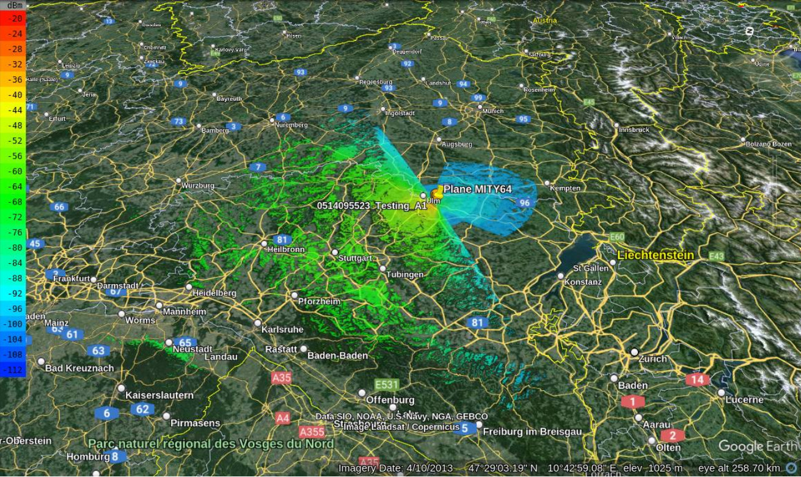

# Automatic Dependent Surveillance-Broadcast (ADS-B) demo

## Background

ADS-B is a surveillance technology for positioning aircraft that is more precise than radar. ADS-B broadcasts information about an aircraft's location, altitude and speed to ground stations every second. This allows the tracking of aircraft through APIs like [ADSB.lol](https://adsb.lol).

[CloudRF](https://cloudrf.com) allows the simulation of radio communications. When combined, these APIs allow a live line of sight or RF calculation of any aircraft's position.

## Demo

Pick a plane from [ADSB.lol](https://adsb.lol) and enter it's asociated **callsign** into the python script in this demo. The script will then send a request to ADSB.lol for the plane data, send a request to CloudRF for heatmap data of where the plane can see, using a radio simulation. 

It will then save a KML file containing a placemark for the plane's location and the coverage heatmap. This kml file can be loaded into Google Earth to view the plane, as a pin, and its line of sight, as a heatmap.

To make the layer refresh periodically, add it as a network KML layer with a time based refresh with a period of 3 seconds.

### Requirements

1. A CloudRF API key in a file named api-key.txt

2. A KML viewer like [Google Earth](https://earth.google.com/intl/earth/download/ge/agree.html)

3. [Python3](https://www.python.org/downloads/)

4. python packages simplekml, urllib, requests

### Installation

	pip3 install simplekml requests

### Operation

	python3 ADSB_demo.py [Call sign]
	
## References

### ADSB

https://adsb.lol

### CloudRF

https://cloudrf.com
