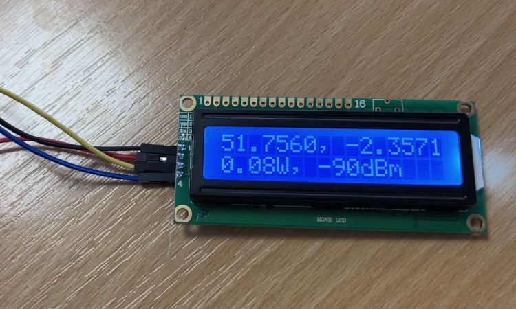

# Automatic Gain Control (AGC) demo

## Background
Handheld radio users normally radiate more power than they need to.
This shortens battery life and increases noise.

Using our modelling API, we demonstrate how a radio's power can be dynamically adjusted, using a closed loop 'AGC' method, to determine the required power to hit the distant station.

By installing the API as a docker container on a low power Pi, this capability can exist at the edge so even a radio which has fallen off the network can benefit from RF modelling, without generating network traffic. *Docker container sold separately. You can use the public API instead.*

## Demo

In this demo a moving DMR handheld radio with 2W max power is talking to another, 5km west upon a small hill in Gloucestershire, UK.
The local radio is moving south on a path which is affected by obstacles including a forest towards the end. As the signal strength changes, the radio power fluctuates to maintain the desired link quality (-90dBm).

When the maximum power is reached (2W) and the desired link is impossible to maintain a WARNING is displayed which could prompt a moving radio operator to think about route selection. The WARNING is present for a 10dB margin after which a FAILURE is printed.

This demo was built on a Raspberry Pi4 using a docker instance of our API at localhost.
You can change the server to use **api.cloudrf.com** instead within the script.

### Requirements

1. An electronics kit like this:
https://www.amazon.co.uk/FREENOVE-Ultimate-Raspberry-558-Page-Detailed/dp/B06W54L7B5

2. A CloudRF account or a SOOTHSAYER server.
https://cloudrf.com/plans/
https://cloudrf.com/soothsayer/

3. An API key in a text file called 'api-key.txt'

4. python3 with requests and urllib

### Operation

    python3 path_demo.py

## Is this AI?
No. It is Automatic Gain Control (AGC), an established concept brought up to date with a modelling API.

## References

### API schema

https://cloudrf.com/documentation/developer/swagger-ui/

### CloudRF

https://cloudrf.com

