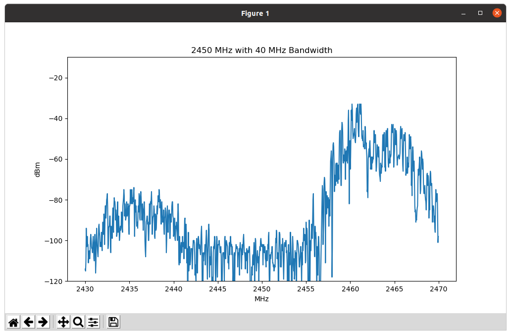

# CloudRF API with CRFS RFeye integration

In this directory contains a customised Python client which can be used to interface with the CloudRF API and a CRFS RFEye node for **automated noise floor modelling**.

## Installation

To get started quickly with this example, you should ensure that you have Python installed on your machine, then you should `pip` install the libraries in the [requirements.txt](requirements.txt) file:

```bash
python3 -m pip install -r requirements.txt
```

### CRFS NCP library

The official CRFS library for interfacing with the RFEye receiver is on [Github](https://github.com/Cloud-RF/python3-ncplib) with documentation [here](https://python3-ncplib.readthedocs.io).

Once done then you can execute the [CloudRF.py](CloudRF.py) script. This script has been written to be as verbose and helpful as possible and so should provide useful feedback when you have passed in an incorrect or missing parameter.

```bash
python3 CloudRF.py
```

Depending on your system you may or may not be required to specify the version of Python, as indicated above. For all other examples in this README the examples will be explicitly passing in the version of Python, however depending on your system you may be required to not use the version.

Upon executing the above you will be presented with an error message, this is normal. This error message will detail that along with executing the script you should also be passing in the type of request which you are looking run, for example:

```bash
python3 CloudRF.py area
```

The above example will initialise the `CloudRF.py` script in `area` mode and will go through the process for an `area` API request.

For each of the request types you can use the `-h` or `--help` flag to output in full a description of what the request type is along with all required and optional parameters.

## Example usage

The below example will do a single `area` request based upon the values in the SNR `template.json` template and an RFEye at IP address 10.0.0.1

```bash
python3 CloudRF.py area -k API-KEY -t template.json --rfeye 10.0.0.1
```

## FFT plotting

With vebose mode, you will get an FFT plot prior to calculation using matplotlib

```bash
python3 CloudRF.py area -k API-KEY -t template.json --rfeye 10.0.0.1 --verbose
```

[

### API Key

The `-k` or `--api-key` flag is required by all request types to authenticate against the CloudRF API service.

```bash
python3 CloudRF.py area --api-key YOUR-API-KEY-HERE
```

### Base URL

The `-u` or `--base-url` flag can be used to define a different endpoint for the CloudRF API service.

By default the script is set to use `https://api.cloudrf.com`.

```bash
python3 CloudRF.py area --base-url https://soothsayer
```

### Templates for constants

Making use of the `-t` or `--input-template` is used to customise your request body through the use of a JSON template, such as those available in the [templates](../templates/) directory. The argument passed into this flag should be given as an absolute path.

```bash
python3 CloudRF.py area --input-template ../templates/5G-CBand-sector.json
```

For most request types `-t` or `--input-template` is a required flag.

### CSV for variables

Making use of the `-i` or `--input-csv` flag is to pass multiple values through to your request. The argument pass into this flag should be given as an absolute path.

```bash
python3 CloudRF.py area --input-csv /home/user/CloudRF-API-clients/python/area.csv
```

The CSV file should include a header row whereby header keys are given in dot notation format, for example to specify the `lat` key on the `transmitter` object would have a header key value of `transmitter.lat` in the CSV.

Depending on your request type will determine how the CSV file is used:

- For `area` and `path` requests the CSV is optional is used to send a request for each of the row you have in the CSV. The values which you specify in the CSV will override the values which you have set in the `--input-template` flag. You are free to override as many or as few values as you wish, there are no requirements to set all values. If you do not specify the flag then the values within the JSON template from `--input-template` will be used.
- For `points` and `multisite` requests this flag is required and each of the row in the CSV represents a point or site for your request. As such the CSV must include all of the fields for the point or site. Please consult to `--help` dialog to see which headers are required for each request.

You can find examples CSVs for each of the requests at:

- [area](csv/area.csv)
- [multisite](csv/multisite.csv)
- [path](csv/path.csv)
- [points](csv/points.csv)


