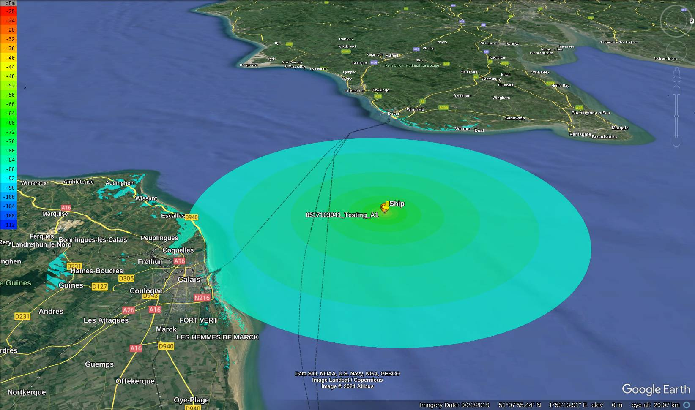

# Automatic Identification System (AIS) demo

## Background

AIS is a system that transmits a ship's position so that other ships are aware of its position. Most ships are required to have an AIS to avoid collisions. APIs like [aprs.fi](https://aprs.fi) allow tracking of ships.

CloudRF allowed the simulation of radio communications. When combined these APIs allow a live line of sight calculation of any ship.

##Demo

In this demo you can pick a ship from [aprs.fi](https://aprs.fi) and enter it's associated **MMSI number** into the c++ program in this demo. The program will then send a request to aprs.fi for the ships location data, send a request to CloudRF for heatmap data of where the ship can see. It will then save a pin of the ships location and the heatmap data into a kml file. This kml file can be loaded into Google Earth to view the plane and it's line of sight.

### Requirements

1. A KML viewer like (Google Earth)[https://earth.google.com/intl/earth/download/ge/agree.html]

2. An API key for CloudRF in a file named rf-api-key.txt

3. An API key for aprs in a file named ais-api-key.txt

### Operation

	./demo.exe or demo.exe
	<MMSI>
	
## References

### APRS

https://aprs.fi

### CloudRF

https://cloudrf.com
