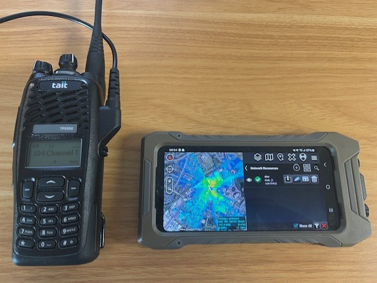

# TAIT DMR live coverage mapping

### *"It’s rare that a portable radio would be used to interface to any software."* - UK Radio Dealer, 2024

This integration demo uses the legacy [CCDI protocol](https://manuals.repeater-builder.com/2006/TM8000/TM8000%20CCDI%20Protocol%20Manual%20v3.01/MMA-00038-01%20TM8000%20CCDI%20Protocol%20Manual%20May%202006.pdf) to fetch GPS data from portable DMR radios for use with the CloudRF simulation API. 

To use it, you will need Tait radios and a 9-pin FTDI programming cable. 
*Some new models have a Bluetooth serial interfaces which can be configured for this instead of a cable.*

You can use different radios together which are defined within (CloudRF) JSON templates but all must be on the same channel to work. This was developed with the TP9300 portable with a serial interface at 19.2kbps. Over the air communication is FSK1200.

An FTDI cable will present itself as **/dev/ttyUSB0** normally on Linux. You can test serial communications using the minicom utility and a press of the transmit button which should generate formatted CCDI messages for key up/down events:

    minicom -D /dev/ttyUSB0 -b 19200

## Install
Install the requirements:

    pip3 install -r requirements.txt

Prepare your radio and API settings within the script:

| Variable    | Description | Example |
| --- | --- | --- |
| local_radio  | Radio ID for the connected radio   | "101" |
| radios | JSON array of radios and templates | {"102": {"callsign": "alice", "lat": 0, "lon": 0, "alt": 0, "template": "TP9300.json"}} |
| interval | Delay between location requests | 10
| ser | Serial Port | serial.Serial('/dev/ttyUSB0', baudrate=19200) |

Place your API settings in a .env file

    api_endpoint=https://api.cloudrf.com
    api_key=123-46e7c8796b2b7b6e0d77259d1ce5502d415ee94c

Create templates for your radios using appropriate settings. A 450M TP9300 DMR template is provided as an example. These will contain the radio and environment settings (eg. City) and the locations within them will be updated with live GPS data.

## Operation

Connect your donor portable radio and start the script..

    python3 tait-coverage.py

The script will iterate over the list of radios and send a GPS request to each one in turn. 

The remote radio should respond within 5 seconds, if reachable, and the donor radio will beep 3 times (...) when it receives a response.

The response contains a NMEA string which is used to update the radio location.

When all radios have been polled, a CloudRF API Multisite request is generated composed of radio settings from the .json templates and the GPS locations. The response is a KMZ file which is downloaded as coverage.kmz and presented within a KML file.

The KML file contains a marker for each radio/callsign and a composite coverage layer. It can be viewed locally in Google Earth as a network KML or shared on the network.

## Viewing the KML in Google Earth (Local)

Add a Network KML in Google earth and set the URL to the tait-dmr.kml file on your computer eg. /home/me/CloudRF/integrations/Tait/tait-dmr.kml. 

Set the refresh to time based with a redraw time to match the interval defined in the script eg. 10s.

The radio marker pins and coverage.kmz heatmap will automatically update as the radios move.

## Viewing the KML in ATAK (Remote)

To share a KML on the network, you can launch a web server in the folder containing the KML, for example:

    python3 -m http.server

Add a network KML using the ATAK "Import" utility and the following URL:

    http://{computer ip}:8000/tait-dmr.kml

Set the refresh to 10s (minimum on ATAK).

When you load the KML, it's normal to see the pins but not the coverage which is a sub-layer which requires approval. Click inside the red KML icon to make it green, and again to access the sub-layer (coverage.kmz). Click it to enable and stream the content.

## CCDI commands

This script uses several Tait CCDI commands, sent as a byte stream to the serial interface. For each command, you must append a 2 byte checksum and a carriage return. 

### Fetch GPS

This remote command requests a location from TELA to be returned to TELO as a SDM message.
The addresses need to be 8 digit numbers so 102 becomes 00000102

    a1B05206{tela}GPGGA,{telo}

If successful, this will trigger a 'r' SDM response after several seconds which ends with the remote radio ID eg. **r0A....102**

### Fetch SDM message

This short 'q' command queries local messages

    q011

This will trigger a response which *might* contain recognisable NMEA strings eg. **$GPGGA**

## Known issues

### Radio locations are mixed up

The NMEA strings are anonymous so must be read in the context of a prior SDM response which contains the radio ID in the location received message which can b e considered an envelope. 

**Slow down the interval** to avoid a message pile up with responses out of sequence. Bear in mind each must be communicated at 1200 bauds! Ideally have the remote radios report autonomously which can be configured from the programming software.

### Network KML is frozen 
If you have 3 radios with a 10s interval then you could get lucky and poll all 3 within 10s but if each takes 8 seconds to reply, it could take 24s plus the Multisite computation time (1-2s).

### Serial connection isn't working
You can check which device your FTDI cable is on when it's plugged in with:

    dmesg | grep tty

The serial port should use 8-bit 1-N-1 standard settings and the baud rate should match what it was set with in the programming software. By default this is 19200bps.

### ATAK shows pins but not the heatmap
The heatmap is a sub-layer so you have to click the active network KML icon to enter it's layers, then enable the coverage.kmz sub-layer and start streaming.

### Radio never replies
If a radio can be reached but chooses to ignore a location request, check the formatting of the 'a' command. A common issue is one of the two 8 digit radio IDs is either incorrect or not properly formatted eg. 101 vs 00000101