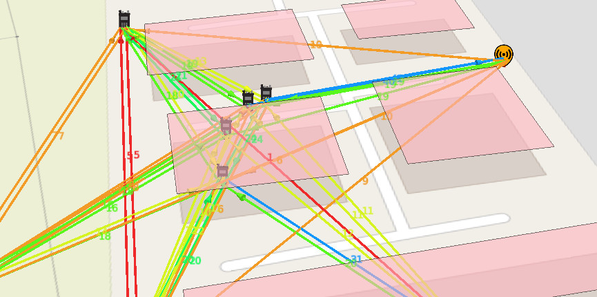

# Trellisware plugin

A python script was created in June 2022 to interface between the Trellisware API on a TW-950 radio and the CloudRF API to enable real time planning and situational awareness. It displays radios and links, and uses the data from the radio to enable quicker, more accurate, planning.

This script has not been published as it exposes details about a private API but a demonstration of this powerful capability is available at CloudRF: 

[Dynamic network planning with hardware APIs](https://cloudrf.com/dynamic-network-planning-with-hardware-apis/)

For more information on radio integrations get in touch via cloudrf.com

