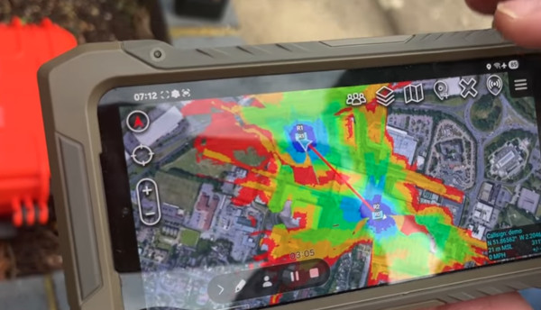

# Trellisware plugin

A python script exists to integrate live coverage mapping onto TAK and other KML viewers but can only be shared with Trellisware authorisation unfortunately. 

You can watch a demo of it working with the TW-750 on youtube: 
https://www.youtube.com/watch?v=PoSxL2CsH0U

If you would like a copy, please contact Marcus Urie at Trellisware.

