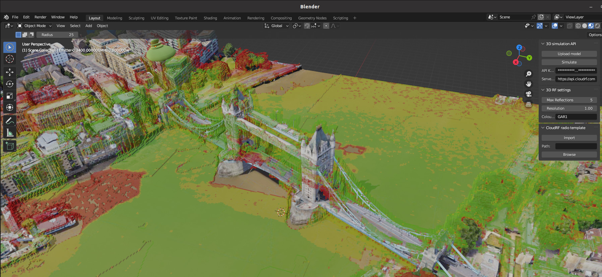

# CloudRF Blender Plugin

## Description

This plugin adds 3D RF simulations using the CloudRF 3D API. 

It POSTs a blender scene to the [model upload API](https://cloudrf.com/documentation/developer/#/3D/3dModelUpload), then POSTs a JSON request containing radio settings to the [3D API](https://cloudrf.com/documentation/developer/#/3D/3d). You can find 3 example radios on the "Add" menu under "Transmitters" and can add more as CloudRF JSON templates.

Results are loaded upon the scene as a GLB file.

## Requirements

1. [Blender 3.x](https://www.blender.org/download/)
2. The Python script and supporting .png image for antenna orientation
3. A premium [CloudRF](https://cloudrf.com/plans) account and API Key

## How to install

- Install the plugin by selecting "Edit" > "Preferences" > "Add-ons". Then click on the button to "Install...". Locate the Python script.
- It will show "Import-Export: CloudRF". Check the box to enable it.
- Close the "Blender Preferences" window.

## How to use

### Adding transmitters

- Add transmitters to your environment from the "Layout" display by clicking on "Add" at the top of the screen, then hover over "Transmitters" and choose a 2.2GHz template radio.

- To move a transmitter, use Blender's Move tool from the top left toolbox. This will show colour coded X/Y/Z planes which you can drag to move the transmitter in three dimensions. 

- Transmitter Properties like power, antenna gain etc can be configured in the data tab in the properties area, located in the bottom right of the screen

### Simulating RF coverage

- On your keyboard press the "N" button to pull out a dialogue window from the top right of the screen. To the right of the dialogue window is a tab labelled as "CloudRF". Click on this.
- Enter your API Key into the "API Key" box.
- Click "Upload model" to send your model to your account. Be patient as this upload could take a while.
- Click "Simulate" to simulate coverage. A small model takes seconds and a large model can take several minutes.
- Your result will be automatically displayed in the viewer.
- Watch the "Blender Info Log" for any errors or information. These will display at the bottom of your screen when they occur. For example "Calculation already in progress, please wait"

NOTE: This is resource intensive so your account can only run one job at a time. You will need to wait if a job is still in process.

### Importing Templates

- Obtain a JSON template with your desired radio settings. Examples can be found (here)[https://github.com/Cloud-RF/CloudRF-API-clients/tree/master/templates].
- Under the "CloudRF" panel in the dialogue window, locate the Import Template tab.
- Click the "Browse" button to locate the JSON file location for the template to be loaded from.
- Click "Import".
- This will add a new transmitter template to the add transmitters menu.

## References

https://cloudrf.com/documentation/developer/

https://blender.org

https://cloudrf.com/plans

