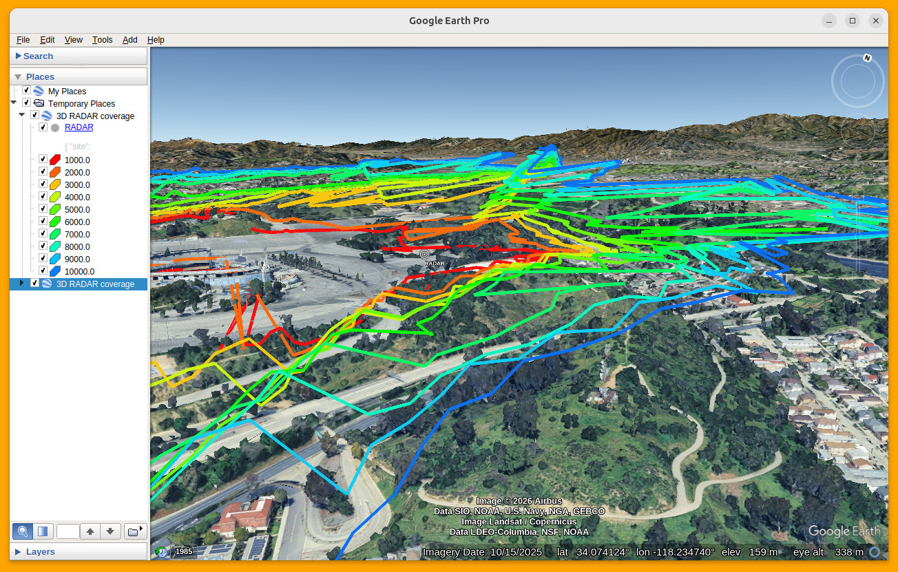
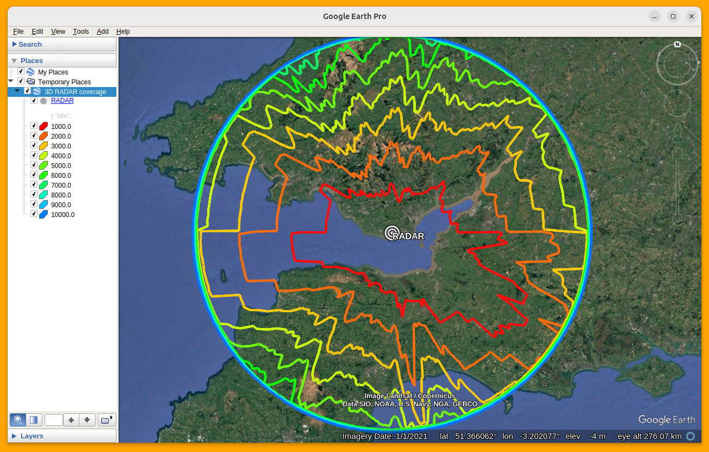
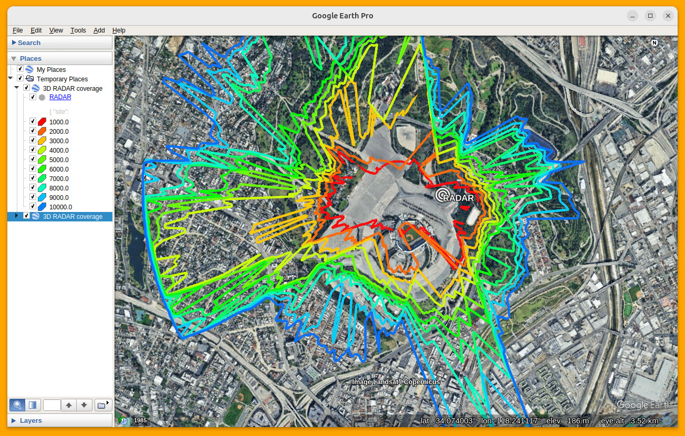

# 3D Airspace analysis

This script leverages the GPU accelerated coverage API at CloudRF to create 3D KML map layers showing coverage at different altitudes.

The radio and environment settings belong in a standard CloudRF JSON template. Two examples are provided for a 100km RADAR and a high resolution counter drone system at an urban stadium.

## Installation

    pip3 install -r requirements.txt

## API key setup
With your CloudRF/SOOTHSAYER API key, create an environment variable called CLOUDRF_API_KEY

    export CLOUDRF_API_KEY=xxxxxxxxxxxxxxxxxxxxxxxxxx

## Operation
The script is called with a single parameter, the JSON template which contains all the settings. These settings are defined in the CloudRF API: https://cloudrf.com/documentation/developer/

    python3 3d-airspace.py {template}.json

Example for RADAR:

    python3 3d-airspace.py ASR-RADAR-100km.json

## RADAR example
This demo uses the RADAR propagation model with a Radar Cross Section of 100m which represents a large aircraft. The receiver height of 10,000ft above sea level is defined using the receiver.alt and and output.units variables.

## Counter Drone system
This demo uses the P.1812 (TSB-88) model for a 2.4GHz drone at altitudes up to a ceiling of 120m above ground level. This is a terrain following relative altitude as opposed to an absolute barometric altitude.

## Rate limiting

Rate limiting is available in the script to stay within commercial limits. Private server owners can set this to 0.

# Supported clients

Any OGC KML compliant viewer can load these.
