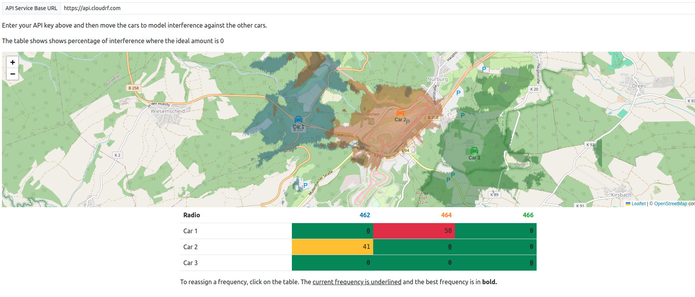

# CloudRF Slippy Map Examples

This directory contains examples of various slippy map libraries.

You can view a live hosted version of these examples at [https://cloud-rf.github.io/CloudRF-API-clients/slippy-maps/index.html](https://cloud-rf.github.io/CloudRF-API-clients/slippy-maps/index.html).

## Local Hosting With Docker

Alternatively, if you have Docker installed on your system, you can spin up a local Nginx web server. Please note that below assumes that you are executing the below from the `slippy-maps` directory.

```bash
docker run -it --rm -p 80:80 -v "$PWD":/usr/share/nginx/html:ro nginx:latest
```

## Spectrum management demo

This demo makes Area API calls for each car and frequency and then analyses the resulting layers to report interference. It is capable of cross-site interference for signals separated in frequency.
